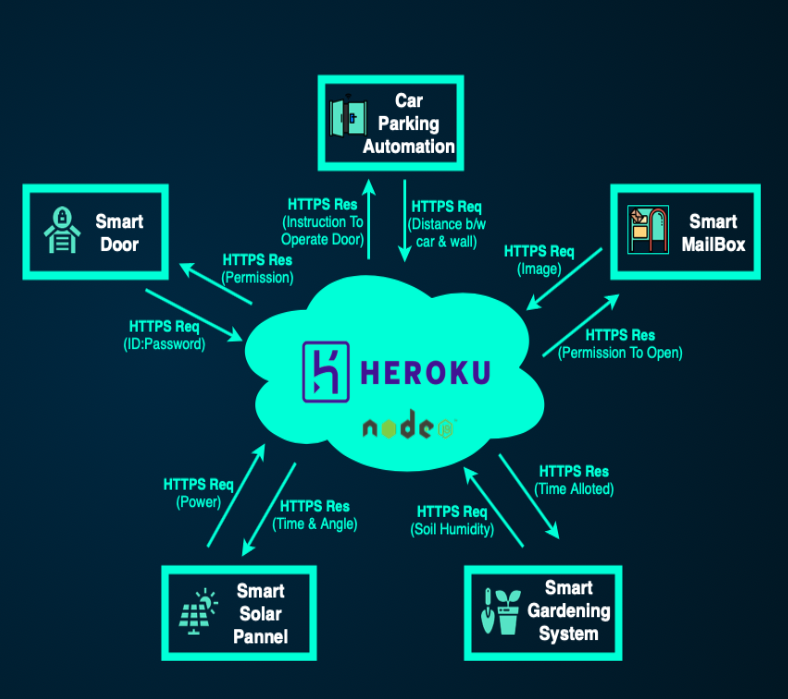
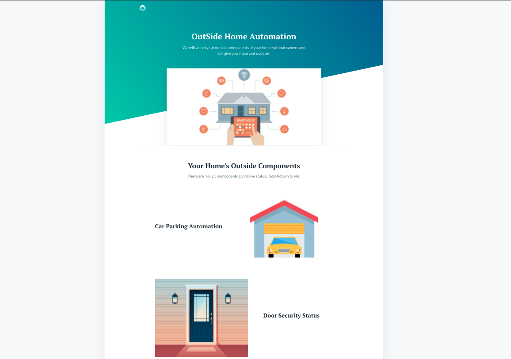

# Prerequisite:
  npm, Socket.io, Express. 

# Steps:

For installing node Setup go to the folders using terminal:
then type:
  
  npm init
  
  npm install 
  
For installing express Setup:
 
  npm install express
  
After that you can use this code.. and Start the server by typing: npm start or node test.js

# Description

 This is a Backend Node Js server hosted on Heroku, which will talk to multiple ESP32s via HTTP GET/POST.
 I am using Socket.IO to keep the connection alive and emiting the broadcasting data to frontend. 

 We have used Node JS (Express and Socket.IO) to create the cloud and hosted on Heroku. Since we have 5 modules, so we have created 5 different micro services. Each services provides one Api which will take care of its assigned modules.

# Service Oriented Architecture:

 

# APIS: Deployed on heroku 

 Open the brower and check hosted heroku frontend: https://outsidehomeautomation.herokuapp.com

 Open the brower and check the local host: http://localhost:8005/index.html 
 
 To check the sever is live or not: https://outsidehomeautomation.herokuapp.com/checkLive

 ## Car Parking 

 Api: https://outsidehomeautomation.herokuapp.com/carparking?id=Send_your_data_to_display

 ## Mail Box 

 Api: https://outsidehomeautomation.herokuapp.com/mailbox?id=Send_your_data_to_display

 ## Door Watchman

 Api: https://outsidehomeautomation.herokuapp.com/door?id=Send_your_data_to_display

 ## Solar Status

 Api: https://outsidehomeautomation.herokuapp.com/solar?id=Send_your_data_to_display

 ## Garden Care 

 Api: https://outsidehomeautomation.herokuapp.com/garden?id=Send_your_data_to_display

# ------------------------------------------------------

### For Git: 

https://github.com/Adityasiwan007/IOT-Home-Automation-Backend

# ------------------------------------------------------

### Demo: 

  

